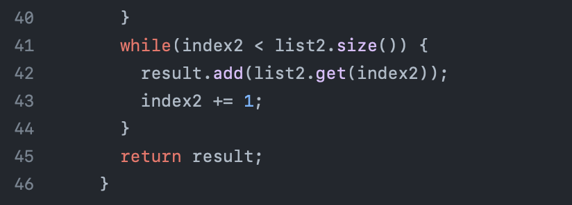

# CSE 15L Lab Report 5 

## Part 1: Debugging Scenario 

User: Nimai 

Hello, I was working on my code and was having some trouble with my ```merge``` method that takes in 2 lists and 
puts them together in sorted order. However, when I try to test this method using ```bash test.sh``` a wrong output
is always given through the terminal telling me the test case failure. I was wondering if I could get some help
fixing this method. Attached are copied of my merge method, test case that is failing, and the terminal output
when I try to run this test case. 


User: CSE 15L TA

Hello! Your test case being used looks properly implemented. There may be something incorrect with your ```merge``` method. 
Have you properly checked that all of your variables are properly named and there are no accidental typos. This may be the root
of your issue. Hope that helps!

User: Nimai 

Thank you for the advice! I just checked my merge method and noticed that the last while loop being used from line 42 to 47 
has a typo with a variable name. I accidently used ```index1``` instead of ```index2``` which ultimately caused an issue with the 
```merge``` method. I was able to fix this and my test cases worked as expected. Thank you for the help!




Directory Structure:

(lib is another directory)

Content of ```ListExamples.java``` before the bug fix: 


Command Line to Trigger the Bug:
```bash test.sh``` 
```test.sh``` contains: 


Description of edit needed to fix bug:
One line 44 of the ```ListExamples.java``` file the variable ```index1``` needed to be renamed to ```index2``` as
the while loop was made to update the contents of ```index2```. This was causing the error when testing the ```merge``` method
through the terminal as an infinite loop was being produced. 

# Part 2: What I Learned for the 2nd Half of the Quarter:
During the second half of the lab, I learned how the auto grader work, which is one of the most interesting thing I learned that I never though about before. I have experience with writing shell script, but I never thought of combining these commands and recreating an auto grader that can actually grade java files and code. Also, another big thing I learned this quarter was how the vim command worked. Just using that command to 
edit files through the terminal itself was cool to learn and experiment with. That was a pretty cool skill to learn in my opinion for this 2nd half of the quarter. 


